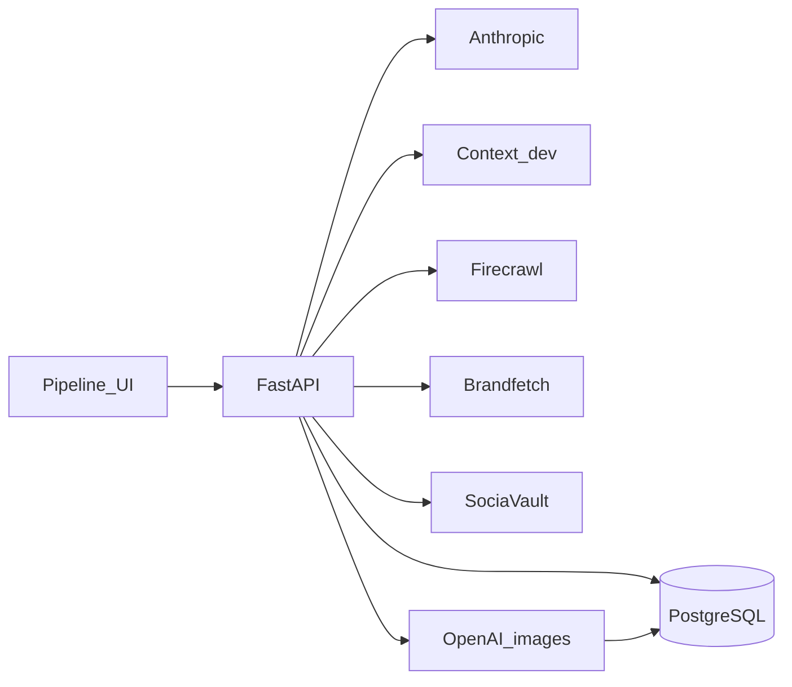

# Release requirements, exports, integrations, acceptance

**Purpose.** Lock what the running product actually ships as the release bar. This is not a plan to add Word/PDF/SharePoint from the August 2026 session notes in [Marketing_in_a_Box_Session_Context.md](Marketing_in_a_Box_Session_Context.md). Those notes still describe L5 as `python-docx` + WeasyPrint + SharePoint; none of that is in the runtime.

Where this document disagrees with code, the code is right.

---

## 1. Release requirements (in scope)

**Product**

- Internal operator app: conversational pipeline, not a general chat.
- **Phase 1:** 15 sequential stages (`icp` through `plan_of_action`). Competitor research is a **gated prepass** inside the consuming stage, not a 16th step ([pipelineData.ts](../application/frontend/src/pipeline/pipelineData.ts)).
- **Phase 2:** 8 stages as a delta over Phase 1, always NEW PAGE for CRO, copy scoped to `sub_service`.
- Human-in-the-loop: approve / refine / stop a stage / skip ahead with seeded context / clear **this phase only**.
- Auth: email + password against Postgres. No OAuth. Password reset is log-only (no mail transport).

**Runtime must-haves**

| Need | Why |
|------|-----|
| Python 3.11, `python -m app` on **8001** (Windows loop rule) | [application/backend/README.md](../application/backend/README.md), [app/main.py](../application/backend/app/main.py) |
| Postgres `DATABASE_URL` | Runs, context, sessions, `MediaAsset` bytes |
| `ANTHROPIC_API_KEY` | Every generation/revision stream |
| Alembic migrations applied | Schema including media |
| Frontend Vite + `/api` proxy | Same-origin pipeline UI |
| Production: `BACKEND_PUBLIC_URL`, `APP_BASE_URL`, `APP_ENV` | Absolute `/media/{id}` URLs; cookie/reset links |

**Not required to ship**

- Redis / Celery (listed in the backend README; **not imported** under `app/`).
- `.env.example` (referenced, file missing).
- GitHub Actions (no workflow in repo).
- SharePoint / Drive / Graph API.
- Outbound email.

**Vendor keys that are optional (pipeline still runs)**

Context.dev, Firecrawl, Brandfetch, SociaVault, OpenAI images, Runway fallback, DataForSEO credentials. Missing keys **skip or stub**; they do not block a signed-in run except where the operator explicitly hits a vendor-only route (see §3).

---

## 2. Export formats (operator-facing)

Universal Download/Share from [exportAsset.ts](../application/frontend/src/lib/exportAsset.ts): **`.md`**, or **`.html` only** when the whole document is one previewable fenced HTML block. Filename `{NN}-{slug}.md` on pipeline cards; Share uses the OS sheet or clipboard.

| Extra | Where | Format |
|-------|--------|--------|
| Per-block HTML | `HtmlPreview` on mixed page outputs (`cro`, `pillar_page`, some hub/lead-magnet) | Copy + `{label}.html` (no stage prefix) |
| Plan map | `plan_of_action` generation overflow menu only | Standalone `{title}-plan-map.html` |
| Webinar slides | `webinar` overflow menu after `POST /pipeline/slides` probe | One deck: `{slug}-slides.pptx`; several: `webinar-slide-decks.zip` |

**Intake, not export:** CSV/XLSX (and related) on social `raw_post_data_source`.

**Not shipped as UI downloads:** PDF, DOCX, generated XLSX, assembled replica HTML (`GET /pipeline/runs/{id}/replica/output` exists; **no frontend button**). Plan map and PPTX are **not** on the Asset Reader pills—only on the generation-card menu.

Topic-suggestion preamble is injected into **`.md` only** ([topicSuggestions.ts](../application/frontend/src/lib/topicSuggestions.ts)).

---

## 3. Supported integrations (runtime)

| Integration | Env | Missing key |
|-------------|-----|-------------|
| PostgreSQL | `DATABASE_URL` | Required |
| Anthropic Messages (+ optional web_search / web_fetch) | `ANTHROPIC_API_KEY` | Cannot generate |
| Context.dev | `CONTEXT_DEV_API_KEY` | Skip scrape/design/replica paid tiers; **503** on `/intel/brand` and `/intel/search` |
| Firecrawl | `FIRECRAWL_API_KEY` | Skip brand-gap extract + competitor social-link resolve |
| Brandfetch | `BRANDFETCH_API_KEY` | Skip last-resort brand fill |
| SociaVault | `SOCIO_VAULT` | Stage 10 prepass skipped / notes; `POST /pipeline/social/posts` degrades |
| OpenAI images | `OPENAI_API_KEY` | Skip hosted hero/proof/CTA unless Runway set |
| Runway images | `RUNWAYML_API_SECRET` | Fallback only |
| DataForSEO | `DataForTopicClusttering_LOGIN` / `_PASSWORD` | **Stub keywords**, not a hard fail |
| Railway | `BACKEND_PUBLIC_URL`, frontend `RAILWAY_PUBLIC_DOMAIN` | Convention, not an SDK |

**Rule:** vendor secrets stay server-side; the only Context.dev constructor is [context_dev.py](../application/backend/app/services/context_dev.py). Credits are money—no URL loops.

**Explicitly not integrations:** Auth0/Clerk, Microsoft Graph, SMTP, Celery/Redis.

---

## 4. Acceptance checklist

**Automated**

- Backend: `pytest` from `application/backend` (never live Context.dev / SociaVault / OpenAI).
- Frontend: `npm run smoke` from `application/frontend` (`smoke`, `card`, `shell`, `plan`, `gate`, `stop`, `clear`, `phase2cro`, `competitors`, `topics` — the entries in [smoke/run.mjs](../application/frontend/smoke/run.mjs)).

**Operator E2E (one sample client)**

1. Sign in; `/health` is `ok`.
2. Phase 1: complete intake → generate → review → save for **ICP, CRO, Pillar Page**; later stages can skip-ahead if dependencies are present or seeded.
3. CRO/Pillar: DESIGN.md path (or NEW PAGE); Download `.md`; HTML block download if present.
4. Webinar: Download `.md`; if Step 5 brief parses, Download `.pptx` (or zip).
5. Plan of Action: Download `.md` + plan-map HTML from the card menu.
6. Stage 10: with `SOCIO_VAULT` unset, prepass skips cleanly; with key, posts land without clobbering a pasted CSV.
7. Stop mid-stream: billing stops; approved cards stay; resume does not offer the stopped stage as “continue”.
8. Clear Phase 2: Phase 1 cards/run untouched; button names the phase.
9. Phase 2: parent run + sub-service; CRO asks the short field set; pillar is about the **sub-service**.
10. Production-only: generated images in HTML use `BACKEND_PUBLIC_URL`, not `127.0.0.1`.

**Fail the release if**

- Generation works without Postgres or Anthropic (it must not).
- A vendor key appears in the Vite bundle or logs.
- Download of a mixed CRO/pillar document is a single `.html` that drops the audit prose.
- Replica assembled HTML is advertised in the UI but unwired (API-only is acceptable if undocumented as an operator feature).

---

## 5. Deferred vs original PRD (not release blockers)

- Automated Word/PDF renderer and SharePoint/Drive upload (session context post-MVP Phase 2).
- Redis draft cache / Celery workers.
- Mail for password reset.
- UI download of assembled replica HTML; per-deck PPTX `?index=` (API exists; UI always zips multiples).
- Refresh [application/backend/README.md](../application/backend/README.md) (“skeleton only”, Redis required) and add `.env.example`.
